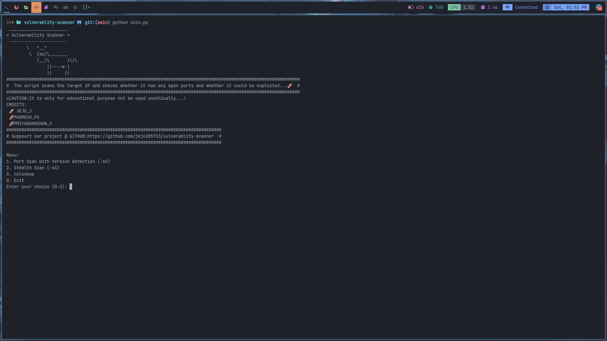

 # Vulnerability Scanner with Exploit Check

This Python script utilizes Nmap to perform a port scan with version detection (-sV) and checks for possible exploits using the Exploit Database. The script provides a simple menu allowing the user to choose between a port scan with version detection, a stealth scan (-sS), or exit.



## Prerequisites

Before running the script, ensure that you have the following prerequisites installed on your system:

- Python 3
- Nmap
- searchsploit
- tqdm

Install Python packages:

```
pip install python-nmap tqdm
```

TO INSTALL NMAP :
```
# For Ubuntu/Debian
sudo apt-get update
sudo apt-get install nmap
```
# For CentOS/RHEL
```
sudo yum install nmap
```
TO INSTALL SEARCHSPLOIT :
# For Ubuntu/Debian
```
sudo apt-get install exploitdb
```
# For CentOS/RHEL
```
sudo yum install exploitdb
```

USAGE:

1.clone the repo
```
git clone https://github.com/your-username/vulnerability-scanner.git
cd vulnerability-scanner
```
2.run the script
```
sudo python vuln.py
```
3.to run the version-2 script:
```
sudo python vuln-v2.py
```

#Follow the on-screen instructions to choose the scan type and enter the target IP address.

#Acknowledgments

    python-nmap
    searchsploit
    tqdm

CREDITS:
```
JEJO.J - author
```
```
PADMESH.PS -co author
```
```
PRIYADHARSHAN -co author
```
