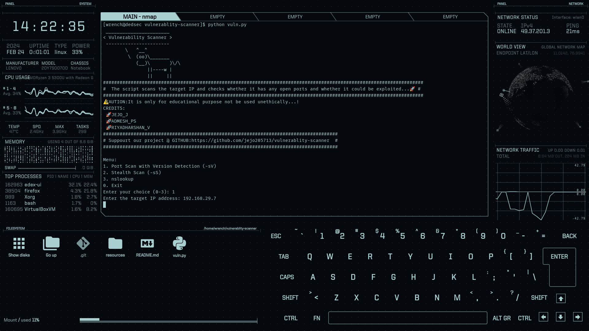

 # Vulnerability Scanner with Exploit Check

This Python script utilizes Nmap to perform a port scan with version detection (-sV) and checks for possible exploits using the Exploit Database. The script provides a simple menu allowing the user to choose between a port scan with version detection, a stealth scan (-sS), or exit.

# THE SCRIPT WITH EDEX:



## Prerequisites

Before running the script, ensure that you have the following prerequisites installed on your system:

- Python 3
- Nmap
- searchsploit
- tqdm
- cowsay

Install Python packages:

```
pip install python-nmap tqdm
```

To install NMAP:
```
# For Ubuntu/Debian
sudo apt-get update
sudo apt-get install nmap
```

To install exploitdatabase :
For Ubuntu/Debian
```
sudo apt install exploitdb
```

To install cowsay:

For Ubuntu/Debian:
```
sudo apt install cowsay
```

For Archlinux:
```
sudo pacman -S cowsay
```

# USAGE:

1.clone the repo
```
git clone https://github.com/your-username/vulnerability-scanner.git &&
cd vulnerability-scanner
```
2.run the script
```
sudo python vuln.py
```

#Follow the on-screen instructions to choose the scan type and enter the target IP address.

#Acknowledgments

    python-nmap
    exploitdb
    tqdm
    cowsay

CREDITS:
```
JEJO.J - author 🚀😎
```
```
PADMESH.PS -co author 😎
```
```
PRIYADHARSHAN.V -co author 😎
```
